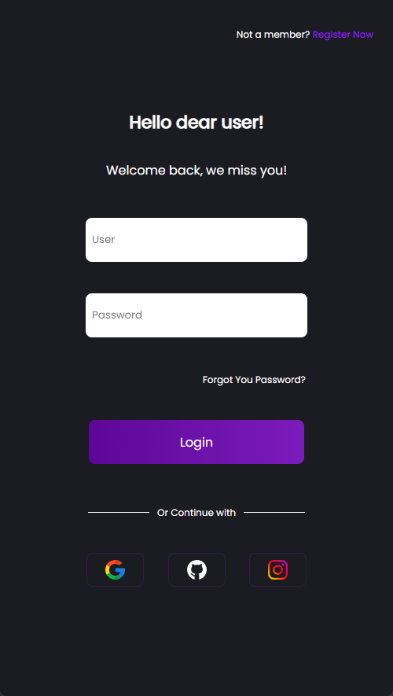

# Login_UI
Atualização de uma landing page de login (07/2021-05/2022), visando a melhoria na estrutura do scss, a aplicação do flex e o responsivo.

## Responsivo
Considerando que a atualização foi feita completamente usando flexbox, a responsividade já vem praticamente pronta, sendo necessários menos de 10 linhas de código para o ajuste.

  
## Motivo da atualização
Demonstrar as habilidades adquiridas durante esse período e manter um padrão de código.
A versão antiga se localiza na branch 'old', neste <a href="https://github.com/UlissesJunior/Login_UI/tree/old" target="_blank" >link</a>

## Demo
Para testar acesse o link: 
<a href="https://ulissesjunior.github.io/Login_UI/" target="_blank" >Login UI</a>
